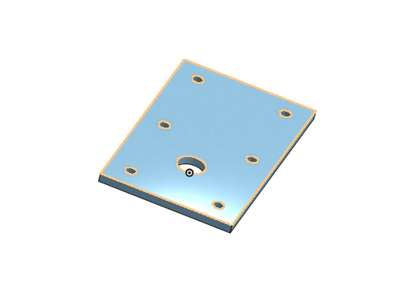
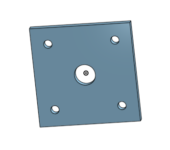
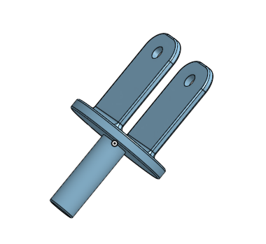
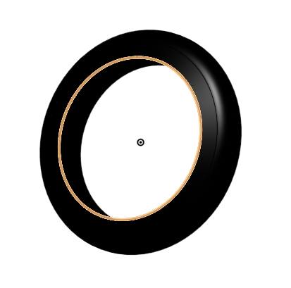
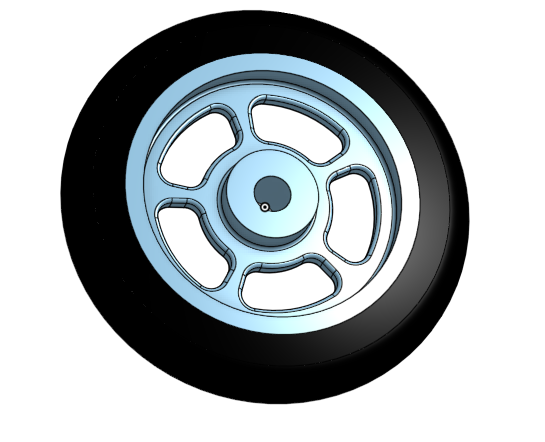
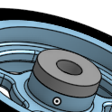
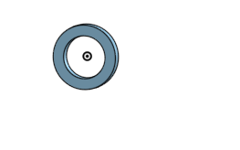
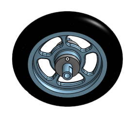

# BasicCAD

We are creating a caster.

---
## Table of Contents
* [Table of Contents](#Table-of-Contents)
* [Base](#Base)
* [Mount](#Mount)
* [Fork](#Fork)
* [Tire](#Tire)
* [Wheel](#Wheel)
* [AxleCollarBearings](#AxleCollarBearings)
* [Sub-Assembly](#Sub-Assembly)
* [Final20%Assembly](#Final20%Assembly)

## Base

### Description

The first assignment is to create the caster base.  The base's dimensions are 200 mm x 120 mm and 8 mm thick.  It has 6 holes 10 mm wide and 20 mm from the edge equally spaced along the edges.

### Evidence
[Link to Onshape](https://cvilleschools.onshape.com/documents/e1c8a17c4a69732c5bb9e3c6/w/10366582a3f14d4162af59ea/e/5e8e1a14726b456f30be3213)

### Image

### Reflection

This was my first Onshape part and [following along with Dr. Shields made it super easy.](https://www.youtube.com/watch?v=93BFUD-HAG8&feature=emb_title&scrlybrkr=5670f0b4)  I learned about 
* sketching (shortcut **shift-s**)
* constructions lines (shortcut **Q**)
* dimensions (shortcut **D**)
* extruding both add and remove (shortcut key **E**)
* linear patterns (no shortcut)

Onshape is awesome. It is going to be a GREAT year in engineering. After doing this assignment, I felt pretty comfortable with extruding and cutting holes in objects, whereas at the beginning I had some trouble with it.

---

## Mount

### Description

For the mount I created a square plate (120mm x 120mm) with 4 smaller holes in the corners (10mm). I used a linear pattern to make the holes identical. Then we put a circle in the direct center that was 25mm wide and extruded it.

### Evidence

[Link to Onshape](https://cvilleschools.onshape.com/documents/e1c8a17c4a69732c5bb9e3c6/w/10366582a3f14d4162af59ea/e/5e8e1a14726b456f30be3213)

### Image

### Reflection

In the first assignment I had a some trouble creating a linear pattern, but because I worked through it I was able to do it easily this time. Only one direction on a linear pattern makes it just a straight line, if you want it to be something else (like a square for this assignment) you have to add another direction. I also learned the "p" toggles whether the planes are hidden or not.

---

## Fork

### Description
 
In this assignment I created a circle 80 mm wide and extruded it. Then I added two rectangles off of it and cut a hole 10 mm wide through the center of them. Then I added a tube 5 mm wide off of the other side of the cylinder and extruded it 60 mm. Then I used the fillet tool on all of the sharp edges to soften it up and I added a "skirt" to the joining between the cylinder and the rectangles.

### Evidence

[Link to Onshape](https://cvilleschools.onshape.com/documents/e1c8a17c4a69732c5bb9e3c6/w/10366582a3f14d4162af59ea/e/5e8e1a14726b456f30be3213)

### Image

### Reflection

This assignment really helped me get good at making sketches on other objects. I learned that when you are cutting a hole and you make it "through all" it cuts through all things in its way, even if those things aren't touching the object that it's sketched on. Tangent propogation allows you to create a skirt with the fillet tools. I liked being able to do the assignment off of written instructions better than a video.

---

## Tire

### Description

In this assignment I created a trapezoid and used the revolve tool to revolve the sketch to make a wheel-like shape. Then I added an 8mm fillet to the edges.

### Evidence

[Link to Onshape](https://cvilleschools.onshape.com/documents/e1c8a17c4a69732c5bb9e3c6/w/10366582a3f14d4162af59ea/e/5e8e1a14726b456f30be3213)

### Image

### Reflection

I had some troube creating the trapezoid, but in the end I figured it out. It was very easy to fillet after all of the practive that I had in the Fork. Symmetric is used to make 2 lines equal distance from a middle line. Trying to dimension distance between 2 non-parallel lines lets you set the angle between them. To make a diameter dimension select a horizontal or vertical centerline, and then select a parallel line in the sketch. Drag dimension across centerline and keep going until dimension doubles.

---

## Wheel

### Description

In this assignment I created a wheel to go to our tire. I made a sketch using diameter dimension and extruded it to fit into the tire. Then, I cut holes into the wheel to make spokes. I added a 4mm fillet to the corners of the spokes, and a 1mm fillet to the whole surface of the wheel.

### Evidence

[Link to Onshape](https://cvilleschools.onshape.com/documents/e1c8a17c4a69732c5bb9e3c6/w/10366582a3f14d4162af59ea/e/5e8e1a14726b456f30be3213)

### Image

### Reflection

The last assignment helped me a lot with this assignment. Because I already knew how to make a diameter dimension and how to dimesnion angles, this was pretty easy. I have to remember that symmetrical makes 2 things equal distance from a center thing. Also, it was a nice refresher on fillet, as I had forgotten a little about them. Center point arcs make an arc that is a specified a length a specific distance away from a centerpoint.

---

## AxleCollarBearings

### Description

For this assignment I first created a tube 4mm think and extruded it 120mm. Then I cut the very ends to be flat. Then I made another tube that went around the end of the first tube, and cut a 3mm hole through the middle of that tube. Then, I went into the Tire/Wheel part that I had previously made and made an additional tube, but this one was an exact extension of the hole through the center of the Wheel. I extruded it 5mm. Then, I opened a blank part and made another tube that was 10mm wide and extruded it 5mm.

### Evidence

[Link to Onshape](https://cvilleschools.onshape.com/documents/e1c8a17c4a69732c5bb9e3c6/w/10366582a3f14d4162af59ea/e/6ab31af2a83ea11aa6d2b0b8)

### Images

### Reflection

After all of this practice with making tubes I am very good at quickly sketching and extruding. I need to remember that adding a merge scope to a removal makes it so that the removal only affects that object. I also learned that in a sketch the use button lets you put a feature that is in another sketch or extrude into the sketch that you are working on. Besides for these 2 things everything else I already had done a bunch so it wasn't too hard.

---

## Sub-Assembly

### Description

In this assignment I learned how to use mates to assemble parts. First, I used a fastened mate to put the wheel at the origin, then I used another fastened mate to center the tire around the wheel. Then I used a revolute mate to put the axle through the center of the wheel, and finally I used 2 revolute mates to mate the bearings to either side of the wheel, around the axle. Because I used revolute mates on the bearings and axle, they could spin freely within the wheel, letting me see how they would turn in real life.

### Evidence
[Link to Onshape](https://cvilleschools.onshape.com/documents/e1c8a17c4a69732c5bb9e3c6/w/10366582a3f14d4162af59ea/e/72261c29d9022e5bb663bbdf)

### Image

### Reflection

I learned a lot about Onshape mates and assemblies in this assignment. I now feel comfortable inserting parts into assemblies and using the revolute and fastened mates. The revolute mate fixes something in place, but lets it rotate around one axis. A fastened mate completely restricts all movement, and locks 2 points together in a way that the objects cannot move or rotate seperate from each other. So far I like using assemblies, I am excited to get to the final assembly assignment.

---

## Final Assembly

### Description

### Evidence
[Link to Onshape](https://cvilleschools.onshape.com/documents/e1c8a17c4a69732c5bb9e3c6/w/10366582a3f14d4162af59ea/e/a96a7e1040c9177e616abf62)

### Image

### Reflection

---
